# Razoo Store

I embarked on this project with the goal of expanding my skills in Java Spring Boot, Redux Toolkit, RTK Query, PostgreSQL, and Tailwind CSS.
By working on this application, I aimed to strengthen my proficiency in React and TypeScript while gaining hands-on experience with Docker for efficient containerization. Throughout this project, I have gained valuable experience and knowledge that I am eager to apply in my future full-stack applications. It has been a rewarding journey, and I am excited to utilize the expertise I have acquired to deliver exceptional solutions.

https://razoo-store.netlify.app

## Sections

- [Built with](#built-with)
- [Functionalities and Usage](#functionalities-and-usage)
  - [Backend](#backend)
  - [Frontend](#frontend)
- [Docker-compose Setup and Starting](#docker-compose-setup-and-starting)
- [Testing](#testing)
- [GitHub Actions](#github-actions)

## Built with

<!-- ICONS found at: ht<rtps://github.com/devicons/devicon/tree/master/icons -->
<!-- https://seeklogo.com/vector-logo/428028/github-actions -->
<div> 
      &nbsp;
      &nbsp;
      &nbsp;
      &nbsp;
      &nbsp;
      &nbsp;
      &nbsp;
      &nbsp;
      &nbsp;
      
</div>
<br>

- The application combines React and Spring Boot, utilizing TypeScript for enhanced development.

- User interface is built with React and TypeScript, featuring page routing through react-router-dom.

- Styling is achieved using Tailwind CSS, providing a modern and responsive design.

- Redux is employed for state management, ensuring efficient data handling.

- Docker is utilized for containerization, facilitating easy deployment and scalability.

- PostgreSQL serves as the database for seamless data storage.

- AWS s3 bucket, used to store product images.

- The frontend has been integrated with a testing framework called VITEST, which allows for comprehensive testing of the React components to ensure their functionality and reliability.

- To streamline the development process, Git Actions have been set up for pull requests to the main branch. These Git Actions automatically run tests and build the Docker Compose application, providing an automated validation process before merging the changes into the main branch.

## Functionalities and Usage

### Backend

- Database:

  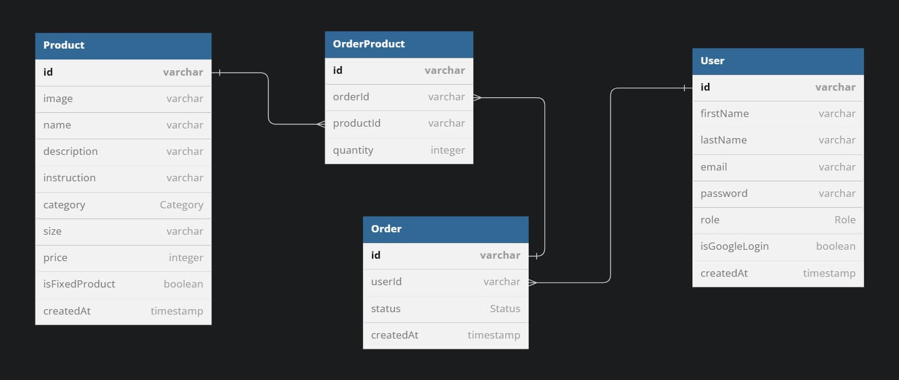

- REST API, you can find all available routes on [https://razoo.onrender.com](https://razoo.onrender.com):

  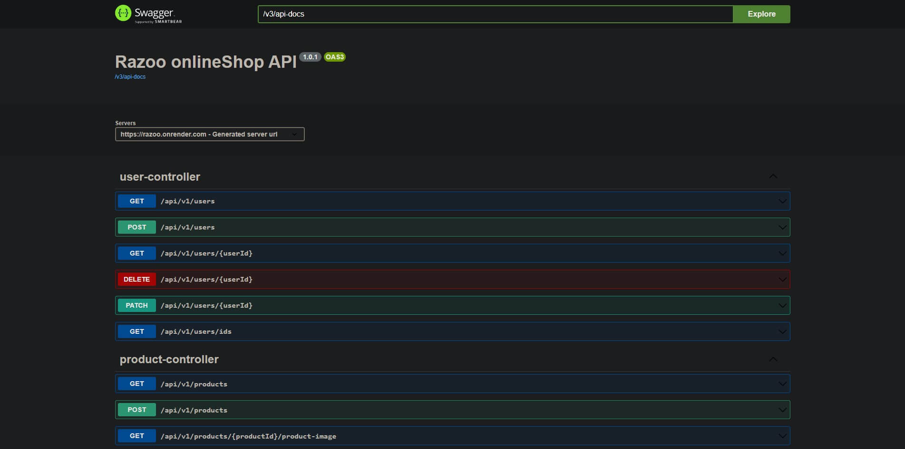

### Frontend

- Main page

  

- Shop page with all available products

  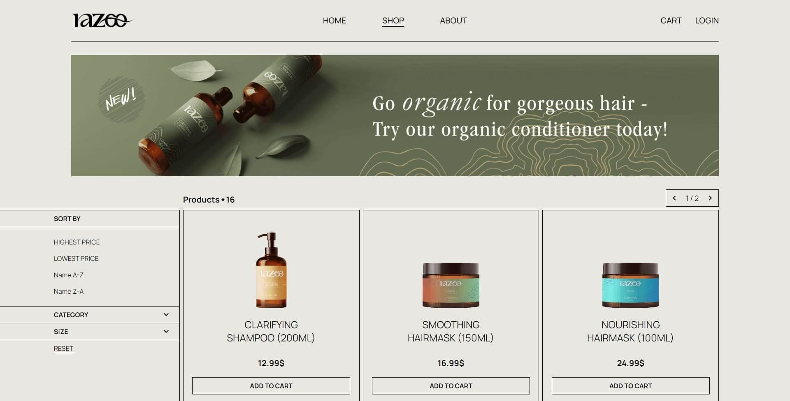

- Here you can set filters and sort options

  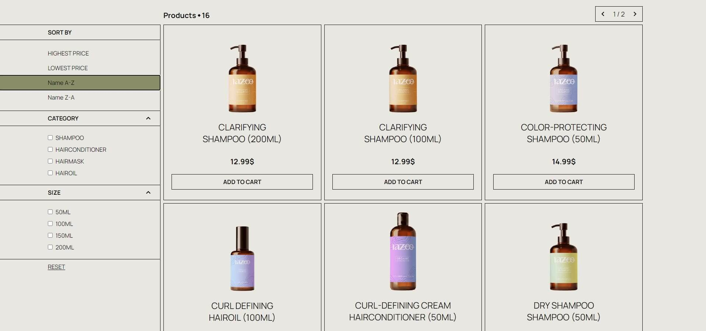

- By clicking on product's card, you can open product's details dialog

  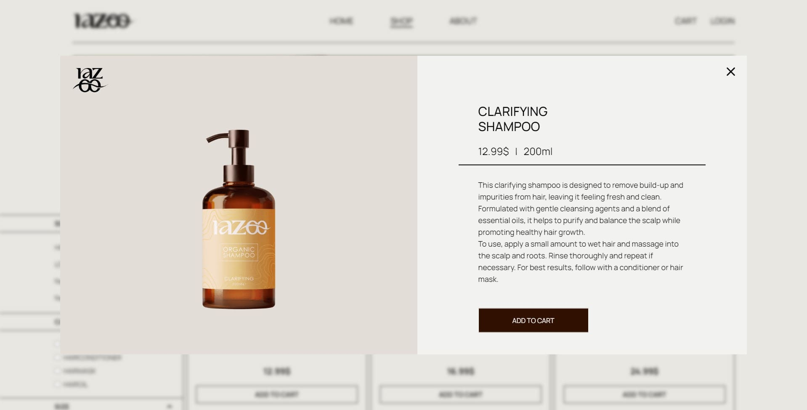

- You can add products to the cart, and proceed checkout for creating new order

  

- To create a new order you need to be authenticated

  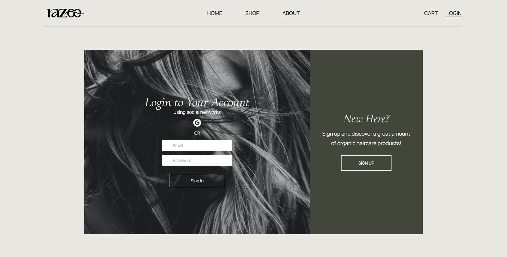

- You can create account with form or use google authorization

  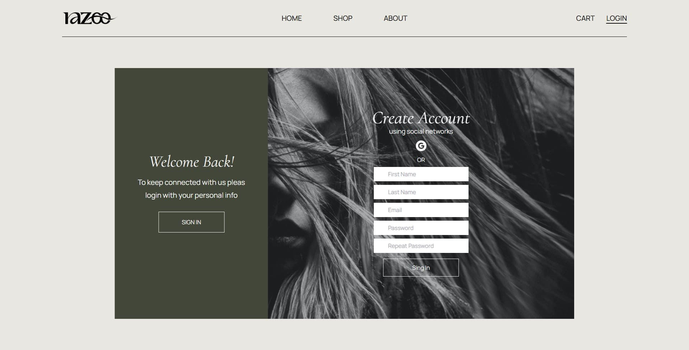

- After login you can create new order by pressing `Complete payment` button

  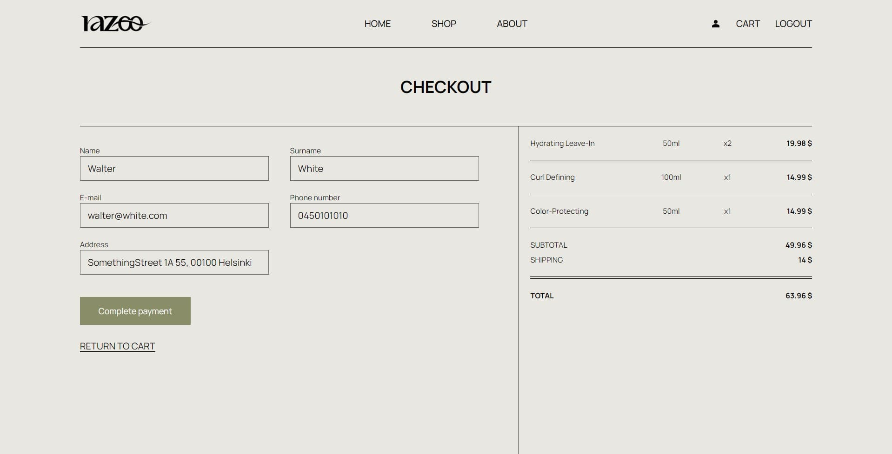

- On the account page, you can find your info and orders

  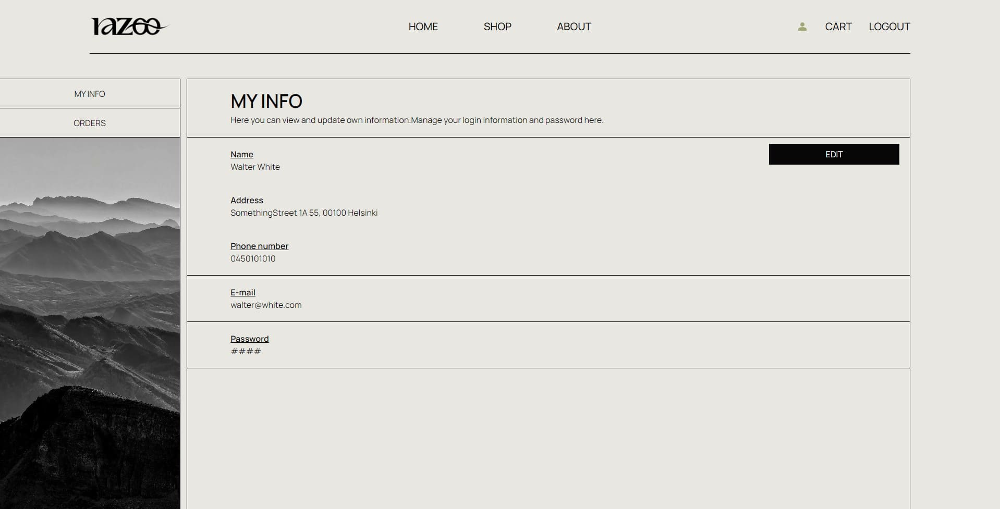

  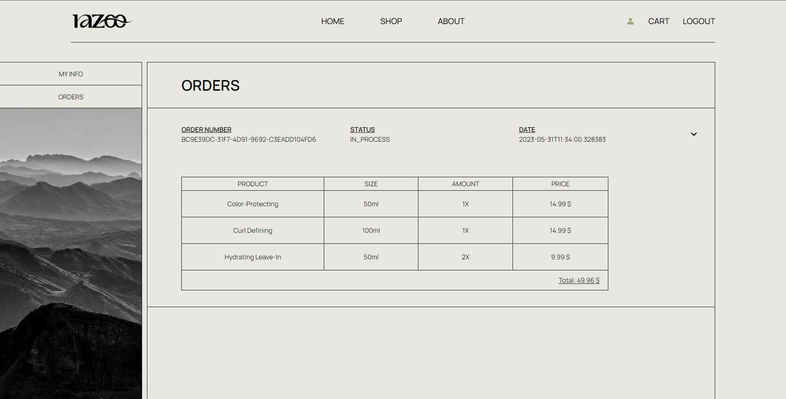

- By login as admin you are able to change/add/delete products, users and orders

  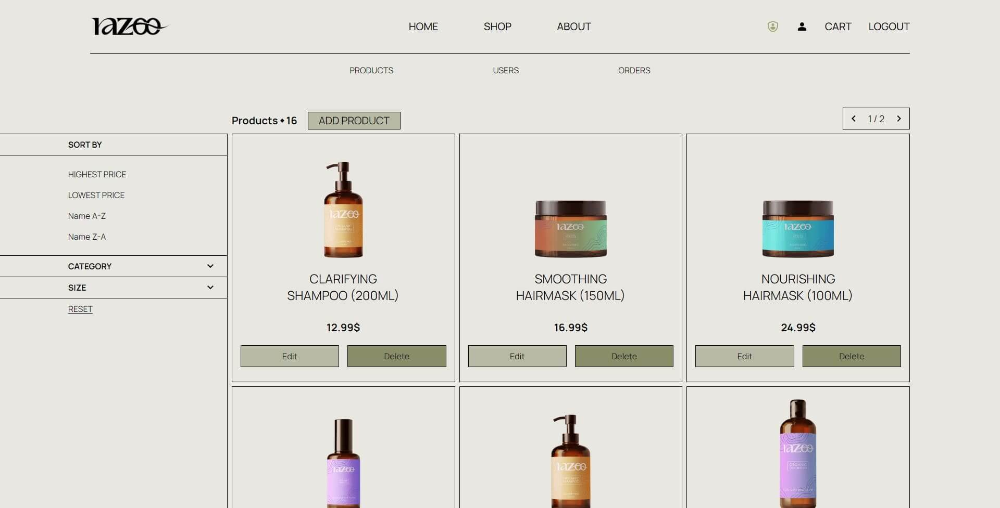

  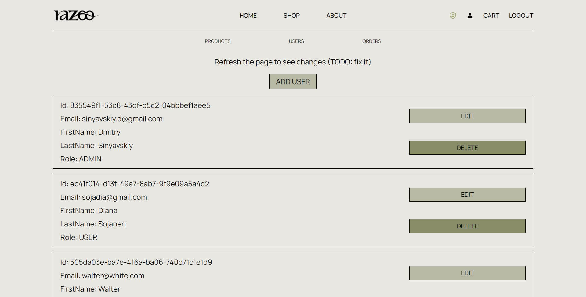

- Also you can change product image with the form

  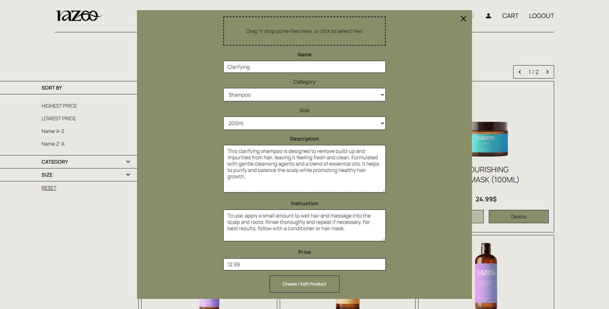

## Docker-compose Setup and Starting

To run the application using Docker Compose, please follow these steps:

1. Make sure you have Docker and Docker Compose installed on your machine. If not, please refer to the Docker documentation for installation instructions specific to your operating system.

```sh
  docker-compose -v
```

2. Clone the repository to your local machine:

```sh
  git clone git@github.com:uch2ha/Razoo-Store.git
```

3. Navigate to the project directory:

```sh
  cd Razoo-Store
```

4. Create a .env file in the root directory of the project and provide the necessary environment variable values. You can use the provided .env.example file as a template.

- Backend

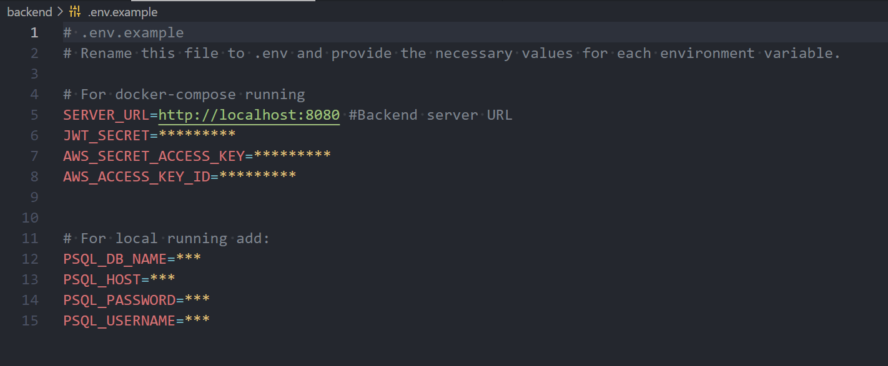

- Frontend

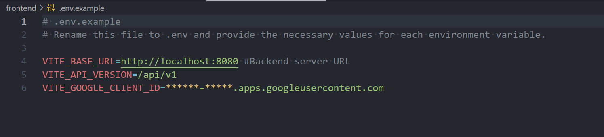

5. Build and start the application containers using Docker Compose. This command will build the necessary Docker images and start the application containers in the background.

```sh
  docker-compose up -d
```

6. Once the containers are up and running, you can access the application in your web browser by visiting the specified URL and port.

- Frontend url: http://localhost:5173

## Testing

The project includes a comprehensive testing approach to ensure the quality and reliability of the application. Currently, the focus is on frontend testing using the VITEST framework, with a combination of unit and integration tests for key components.

- ### Frontend Testing with VITEST

  The frontend components have been thoroughly tested using VITEST, a powerful testing framework for React applications. Unit tests have been created to verify the individual components in isolation, ensuring their correctness and functionality. Integration tests have been implemented to test the interaction and behavior of multiple components working together.

- ### Future Testing Expansion
  As the project evolves, the testing approach will be expanded to include backend testing and add more frontend tests to cover all critical aspects of the application. This will further enhance the reliability and robustness of the system.

## GitHub Actions

This project utilizes GitHub Actions to streamline the development workflow. Whenever a pull request is made to the main branch, a series of automated steps is triggered, such as an automated testing process and building the Docker Compose application, to ensure the application's reliability and quality before merging the changes. By automating the deployment process, potential errors or issues can be identified early on, leading to more efficient development.
