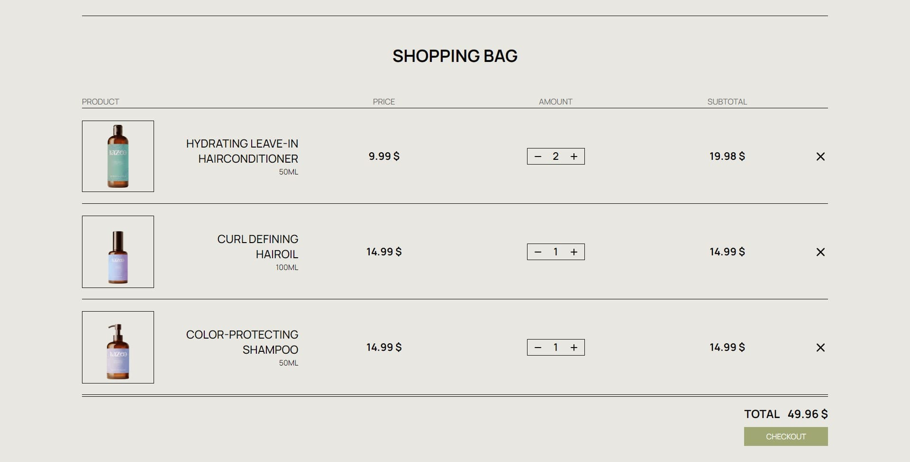

# Razoo Store

https://razoo-store.netlify.app/

## Built with

<!-- ICONS found at: ht<rtps://github.com/devicons/devicon/tree/master/icons -->

 
      &nbsp;
      &nbsp;
      &nbsp;
      &nbsp;
      &nbsp;
      &nbsp;
      &nbsp;

 

The application combines React and Spring Boot, utilizing TypeScript for enhanced development. The user interface is built with React and TypeScript, featuring page routing through react-router-dom. Styling is achieved using Tailwind CSS, providing a modern and responsive design. Redux is employed for state management, ensuring efficient data handling. Docker is utilized for containerization, facilitating easy deployment and scalability. PostgreSQL serves as the database for seamless data storage. AWS s3 bucket, used to store product images.

## Functionalities and Usage

### Backend

- Database:

  

- REST API, you can find all available routes on [https://razoo.onrender.com](https://razoo.onrender.com):

  

### Frontend

- Main page

  

- Shop page with all available products

  

- Here you can set filters and sort options

  

- By clicking on product's card, you can open product's details dialog

  

- You can add products to the cart, and proceed checkout for creating new order

  

- To create a new order you need to be authenticated

  

- You can create account with form or use google authorization

  

- After login you can create new order by pressing `Complete payment` button

  

- On the account page, you can find your info and orders

  

  

- By login as admin you are able to change/add/delete products, users and orders

  

  

- Also you can change product image with the form

  
